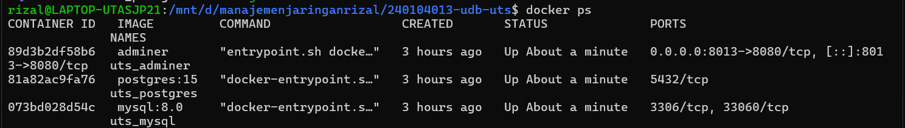
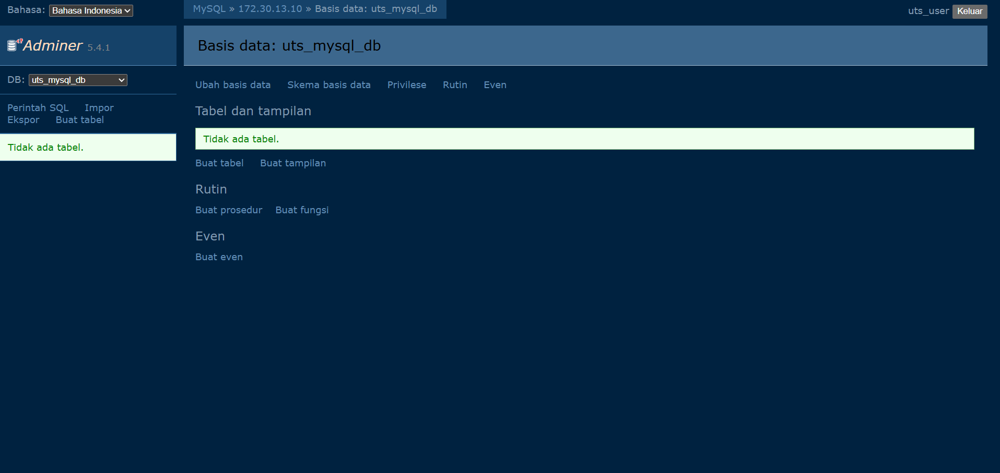
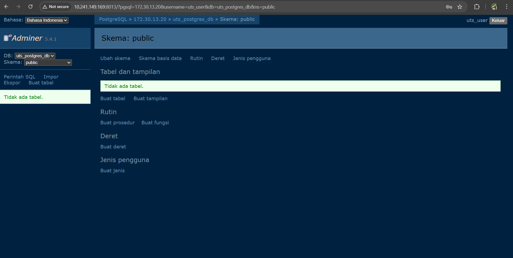
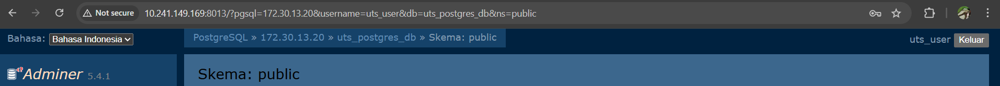

# UTS Praktikum Docker & Database

## Nama & NIM Mahasiswa
Nama : Yusuf Rizal Indrianto  
NIM  : 240104013  

---

## Port Adminer yang Digunakan
Adminer dijalankan menggunakan port unik berdasarkan 2 digit terakhir NIM.

- **Port Adminer**: `8013`
- Format port: `8 + 2 digit terakhir NIM`

---

## IP ZeroTier
Project ini diakses melalui jaringan ZeroTier.

- **IP ZeroTier Host**: 10.241.149.169


---

## Cara Menjalankan Project

1. Pastikan Docker dan Docker Compose sudah terpasang
2. Pastikan ZeroTier sudah terinstall dan device sudah join network
3. Masuk ke direktori project:
 ```bash cd 240104013-udb-uts```
4. Jalankan dengan command : docker compose up -d
5. Kemudian cek docker dengan command : docker ps

##screnshot








